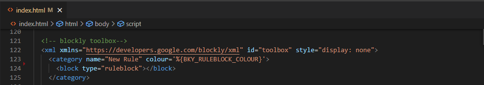
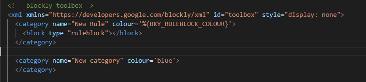
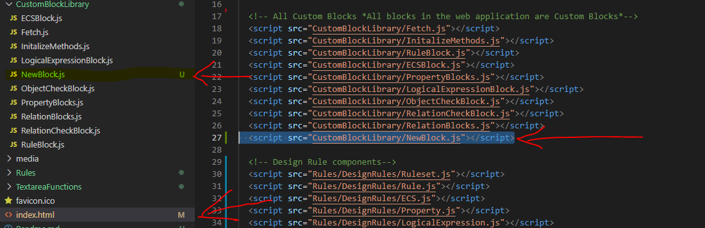
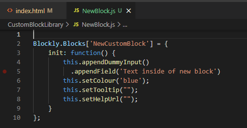
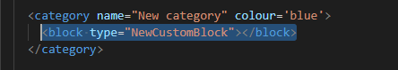
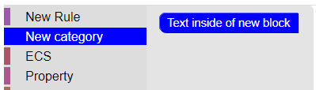
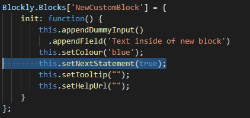
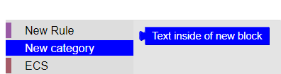
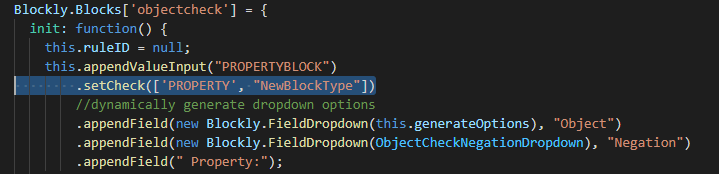
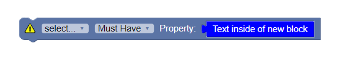

# Overview
This is a web based application that is a GUI for creating and editing rules. This application integrates Blockly, an open-source software, to create a block-based visual for creating kitchen design rules. Blockly hompage: https://developers.google.com/blockly

To run this application download the project and open the index.html file located in the blocklyApplication folder using Google Chrome.

# Documentation
To develop this application download the project and open the blocklyApplication folder in a code editor.

## Table of Contents
1. index.html
2. Rules
3. CustomBlockLibrary
4. Libraries
5. Examples

## 1. index.html
This is the main and only html page of the application.
### 1.1 buttons and ruleset name input
These are located at the top of the page. JS files related to these elements can be found in the ButtonFunctions folder. The **Import Ruleset** button is used to import a .json file containing a ruleset object into the blockly workspace. **Export Ruleset** button is used to export the current blockly workspace into a .json file. **Clear Workspace** button can be used to delete all blocks in the blockly workspace. The **Ruleset name:** input is used to update the name of .json file created and exported when **Export Ruleset** button is clicked.

### 1.2 blockly workspace
On the left there is a toolbox with categories that can be clicked to display blocks than can be dragged into the workspace. To add/delete/modify a category update the toolbox xml element in index.html. The blocks in each category can be updated by modifying the child elements of the appropriate category element. Examples can be found at in the examples.

In the main section blocks can be connected to create rules. If a block is not completed (for example a child block is missing) a warning icon will pop up on the top left of the block. This icon can be clicked to display a hint indicating the issue. Click the icon again to close the hint. Blocks can be deleted by selecting them and pressing the delete key on your keyboard or by dragging and dropping them on the toolbox or garbage icon located at the bottom-left of the workspace. The workspace has an onchange event handler (located in index.html) that is fired whenever a block is created/modified/moved/deleted.

### 1.3 nlr textarea
This section is to the right of the blockly workspace. It contains a translation of the current blockly workspace in json format. The onchange event handler is used to update this definition whenever the blockly workspace is modified. Functions used in the onchange event handler can be found in the OnChange.js file located in TextareaFunctions folder. Currently updating the text area will not have an effect on the blockly workspace. On the right of this section there is a button that can be used to hide and show the text area. In addition the space between the blockly workspace and nlr textarea can be draged left and right to resize the two elements. JS files related to these stylings can be found in TextAreaStyle.js in the TextareaFunctions folder.

## 2. Rules
This folder contains two folders **DesignRules** folder and **BlockToRuleTranslate** folder. The **DesignRules** folder contains .js files with classes of design ruleset components. The **BlockToRuleTranslate** folder contains .js files for translating a rule block to a design rule. These files also contain a funcions to convert the class into xml. This is used when importing blocks.

## 3. CustomBlockLibrary
This folder contains files containing the definitions for custom blocks used in the blockly workspace. These files have the word "block" as a suffix. The BlockColor.js file contains the colors for blocks update these value to change the block colors. Initalize Dropdowns.js contains definitions for all dropdowns.

## 4. Libraries
This application uses Blockly See: https://developers.google.com/blockly and FileSaver See: https://github.com/eligrey/FileSaver.js/

# Examples
## Create a new Category
In index.html go to the element with id = "toolbox".

Then add a new category element. The name and color attributes is what the toolbox will display when the application is opened.
 

## Create a new Block
In the CustomBlockLibrary folder create a new file called **NewBlock.js**. In index.html inside the head element add this line:

Then in NewBlock.js add the following lines: 

This is the custom blocks definition. It currently has its type set to 'NewCustomBlock'. It has one dummy input which will be displayed in the block: .appendField('Text inside of new block'). And the color of the block is set to blue in line: **this.setColour('blue');**.

Then in index.html find the element with id="toolbox" and add the block to one of the categories as shown in the picture:

After following these steps save all your files and open index.html in a browser. You should now be able to see the new block in the appropriate category. 

## Adding connections to Block
Go to the Custom Blocks definition. Then add a statement connection: **this.setNextStatement(true);** 
  
Now the custom block has a nextStatement connection. 
 
To add a value connection: add this.setOutput(true, "NewBlockType"); 

You will notice if you try to connect this block to a object check block it won't work. Object check blocks have **.setCheck('PROPERTY')** configuration. This means that they only accept value inputs with the type 'PROPERTY' and our input has the type "NewBlockType". To allow connections between Objectcheck blocks and NewBlock blocks add another type to the .setCheck configuration. Replace **.setCheck('Property')** with **.setCheck(['PROPERTY', "NewBlockType"])** in ObjectCheckBlock.js.
  
Now you should be able to connect the two blocks. 
 
Blockly documentation on creating custom blocks: https://developers.google.com/blockly/guides/create-custom-blocks/define-blocks#previous_connection 

## New Block to JSON
In this example we will create a new pseudo design rule component called SpecialObjectCheckProperty. This will be similar to the Property component except this block will only be able to attach to ObjectCheck blocks.
### 1.Add a new design rule.
Create a new file in the DesignRules folder called **SpecialObjectCheckProperty.js**. In this file add a class for a new component. Also add a reference to this script in index.html. Here is the class I will be creating:  
//image of class file
 
This component will be used to define an objectcheck property with an operation (equal or not equal), a logical operator (and, or, xor) and 2 values (light, door, handle etc.).
An example of the new component: Object1 must have equal (light and door). Translation: object1 must have a door and a light.  
### 2. Add a custom block
Now a custom block must be created so that we can use this new component in the blockly visual.
In CustomBlockLibrary folder create a new file called **SpecialObjectCheckPropertyBlock.js**. Make sure to add a refrence to this file in index.html.
In this file add the block definition that corresponds to the class created in step 1.
//image of block
Now in index.html add this block to the property category in the toolbox element
//image of index.html tool box
After following these steps open/refresh the block application in a browser. If you open the property category you should see the newly created block.
//image new block in workspace

